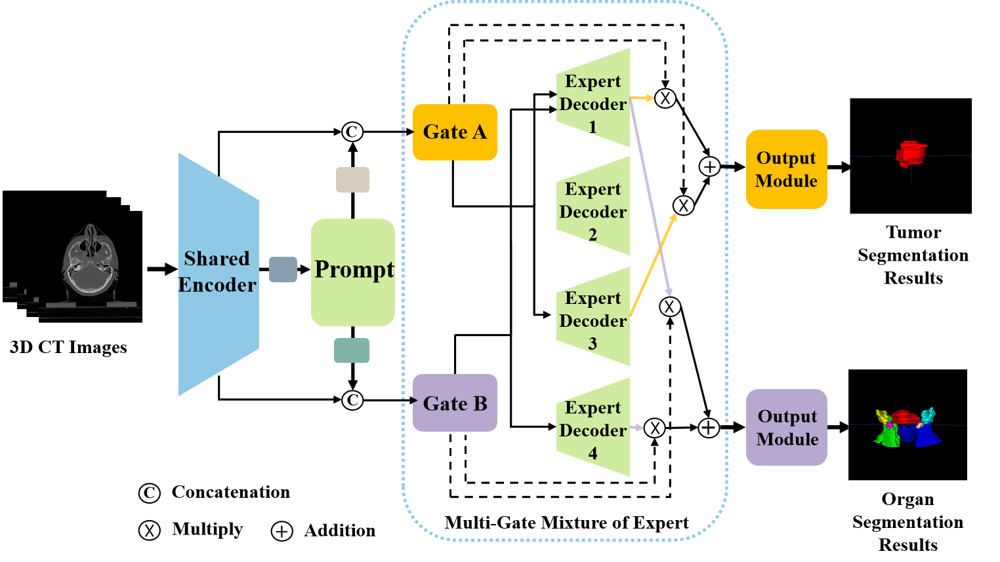

# ROJS-Net: Multi-objective joint segmentation network for tumor and organs-at-risk
This is the project web for the study titled "Multi-objective joint segmentation network for tumor and organs-at-risk".

<div align="center">
  
</div>

## Installation

  Install PyTorch and torchvision from http://pytorch.org and other dependencies. You can install all the dependencies by
  ```bash
  pip install -r requirements.txt
  ```

### Data Preparation
The folder structure of the data should be like

    data/
      ├── index
        ├── train_path_list.txt
        ├── val_path_list.txt
        ├── test_path_list.txt
      ├── TrainingImage
        ├── image_1.nii.gz
        ├── image_2.nii.gz
        ├── ...
      ├── TrainingMask
        ├── organ_1.nii.gz
        ├── organ_2.nii.gz
        ├── ...
      ├── TrainingTumor
        ├── tumor_1.nii.gz
        ├── tumor_2.nii.gz
        ├── ...

### Pre-training

  To pre-train our ROJS-Net, run `train.py`. The weights will be saved in `./result/res_semmoe_prompt/`. You can also use the pre-trained checkpoints of ROJS-Net in the `./result/res_semmoe_prompt/`. 


### Test

  Run `predict.py`, and the segmented image will be saved in `./result/res_semmoe_prompt/prediction/`, then can obtain the Dice, HD95 and ASD values by running `compute_value.py`.

##  Citation
If this code is helpful for your study, please cite:
```bibtex

```

## 4. References
- 
